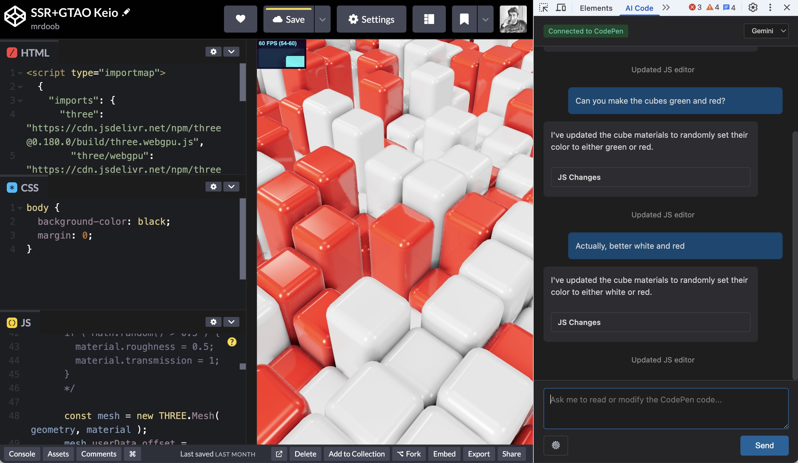

# Chrome Code

AI coding assistant for CodePen, integrated into Chrome DevTools.

## Installation

1. Go to `chrome://extensions/`
2. Enable "Developer mode"
3. Click "Load unpacked" and select this folder

## Setup

1. Open a CodePen page
2. Open DevTools (F12) → "Chrome Code" tab
3. Select AI provider (Claude, Gemini, or Local)
4. Click ⚙️ and enter your API key (if using Claude or Gemini):
   - [Claude](https://console.anthropic.com/)
   - [Gemini](https://aistudio.google.com/apikey)
   - Local: Uses Chrome's built-in AI (requires Chrome flags)

## Usage

Chat with the AI to read and modify your CodePen code. The agent can update HTML, CSS, and JavaScript directly in the editors.

## License

MIT
